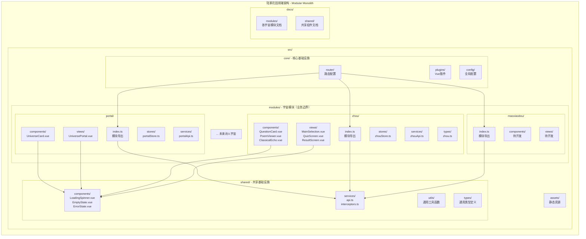

# Vue技术栈统一化 - 宇宙门户现代化重构 TODO

> **🤖 AI 助手注意 (AI Assistant Attention)**
> 在执行本文件中的任何任务前，你必须首先阅读并严格遵守位于 `documentation/ai-collaboration-guide.md` 的全局协作指南。

## 目标
解决当前前端技术栈混合使用的架构债务，实现Vue技术栈的完全统一化。通过在现有`frontend_vue`项目基础上建立Vue版本的宇宙门户，消除"原生HTML门户 → Vue周与春秋"的技术栈跳跃问题，建立"Vue门户 → Vue周与春秋"的一致化用户体验。确保在开发环境(5173端口)完成完整的Vue体验流程验证，为后续生产环境切换奠定坚实基础。

## 核心价值分析
- **技术栈一致性**: 消除原生HTML/JS与Vue3混合使用的维护复杂度
- **用户体验连续性**: 统一的现代化交互模式、动画效果和视觉语言
- **组件复用价值**: 最大化利用已开发的13个Vue组件和完整的设计系统
- **开发效率提升**: 统一技术栈带来的开发工具链和调试体验优化
- **风险控制**: 渐进式验证，确保功能完整性后再考虑生产部署

## 范围与约束
- **范围**: 在现有`lugarden_universal/frontend_vue`项目基础上扩展宇宙门户功能，调整路由结构，确保设计系统一致性
- **约束**:
  - 必须保证周与春秋所有现有功能100%不变，仅调整路径前缀
  - 宇宙门户文字内容必须与原生HTML版本完全一致
  - 设计风格必须与现有Vue前端保持100%统一(字体、按钮、卡片、颜色、动画、间距)
  - 在开发环境(5173端口)完成完整验证后，才考虑修改生产环境(3000端口)路由
- **技术原则**: 
  - 最大化复用现有组件和服务层(80%+复用率)
  - 保持Vue技术栈纯净性，避免引入新的技术债务
  - 确保API兼容性，无需修改后端代码

## 任务列表

> **任务编号规范**
> - 使用2025-08-28_A标识本阶段：任务A.1、任务A.2 …；步骤使用"A.1.x"的三级编号

---

### **阶段2025-08-28_A：Vue宇宙门户建立与验证**

#### 🎯 **A阶段核心目标**
在现有`frontend_vue`项目基础上建立Vue版本宇宙门户，实现技术栈完全统一化，确保5173端口展示一致化的Vue体验流程。

#### - [ ] 任务A.1：Frontend架构重构 - 从Type-based到Feature-based的Modular Monolith转型
- **核心思想**: 基于项目多宇宙扩展需求和基础设施管理思维，将现有Type-based结构重构为Feature-based的Modular Monolith架构，建立可持续发展的技术基础设施，支持未来N个诗人宇宙的标准化接入
  
- **项目特征重新定位**:
  - **项目性质**: 中长期多宇宙平台（非小型项目）
  - **维护模式**: 单人维护为主，需要极高可维护性
  - **扩展需求**: Portal + Zhou + Maoxiaodou + 未来N个诗人宇宙
  - **组件规模**: 当前13个组件，预计扩展至50+组件
  - **技术定性**: 中型项目，应采用Feature-based最佳实践

- **当前架构分析**:
  ```
  现状: Type-based结构 + 单一功能域(Zhou)
  ├── components/ (13个组件，大部分zhou专用)
  ├── views/ (5个页面，全部zhou相关)
  ├── stores/zhou.ts (zhou专用状态管理)
  └── types/zhou.ts (zhou专用类型)
  
  问题: 
  - 语义上是zhou专用应用，Type-based结构合理
  - 引入portal后将打破单一职责原则
  - 未来多宇宙扩展会导致文件混乱和维护困难
  ```

- **目标架构: Modular Monolith**
  ```
  lugarden_universal/frontend_vue/src/
  ├── modules/              # 宇宙模块（业务边界隔离）
  │   ├── portal/          # 宇宙门户模块
  │   │   ├── components/  # 门户专用组件
  │   │   ├── views/       # 门户页面
  │   │   ├── stores/      # 门户状态管理
  │   │   ├── services/    # 门户API服务
  │   │   └── index.ts     # 模块统一导出
  │   ├── zhou/            # 周与春秋模块
  │   │   ├── components/  # 周与春秋组件
  │   │   ├── views/       # 周与春秋页面
  │   │   ├── stores/      # 周与春秋状态
  │   │   ├── services/    # 周与春秋API
  │   │   ├── types/       # 周与春秋类型
  │   │   └── index.ts     # 模块统一导出
  │   ├── maoxiaodou/      # 毛小豆宇宙模块
  │   └── [future-poet]/   # 未来诗人宇宙
  ├── shared/              # 共享基础设施
  │   ├── components/      # 通用UI组件库
  │   ├── services/        # 通用服务层
  │   ├── utils/           # 通用工具函数
  │   └── types/           # 通用类型定义
  ├── core/                # 核心基础设施
  │   ├── router/          # 路由配置
  │   ├── plugins/         # Vue插件
  │   └── config/          # 全局配置
  └── assets/              # 静态资源
  ```

- **架构优势分析**:
  - **模块化隔离**: 每个宇宙独立，避免单点故障，问题定位快速
  - **可扩展性**: 新诗人宇宙按标准结构创建，接入成本最小化  
  - **标准化**: 统一的开发和部署模式，便于维护管理
  - **并行开发**: 可在不同宇宙间切换开发，互不干扰
  - **依赖隔离**: 宇宙间不相互依赖，仅依赖shared层
  - **渐进迁移**: 可逐个宇宙进行技术升级
  - **基础设施友好**: 分层架构，监控和错误追踪清晰

- **架构示意图**:


- **成本效益分析**（基于实际代码分析修正）:
  - **重构成本**（一次性）: 
    - A.1.1 架构准备: 1-1.5个工作日
    - A.1.2 Zhou迁移: 4-5个工作日（25-30个文件，分7个步骤）
    - A.1.3 共享层建立: 2-3个工作日（复杂的组件分类决策）
    - A.1.4 Portal开发: 3-4个工作日（新功能开发，非重构）
    - A.1.5 路由重构测试: 2-3个工作日（50+ import路径调整）
    - **总计**: 12-16.5个工作日（比原预期增加2-3倍）
  - **长期收益**（持续）:
    - 新宇宙开发效率: 提升60%（第3个宇宙开始显现）
    - 维护成本: 降低40%（模块化边界清晰）
    - Bug定位时间: 减少70%（问题域隔离）
    - **收益实现**: 3-4个宇宙后开始显著体现ROI

- 交付物：
  - 完整的Modular Monolith架构目录结构
  - Zhou模块完整迁移（所有组件、页面、服务、状态、类型）
  - Shared层组件库建立（通用组件抽离）
  - Core层基础设施配置
  - Portal模块基础框架
  - 架构文档和最佳实践指南

- 验收标准：
  - 新架构目录结构建立完成
  - Zhou功能100%迁移成功，所有原有功能正常
  - Shared层通用组件可被多模块复用
  - 模块间依赖关系清晰，仅通过shared层通信
  - 路由系统支持多模块管理
  - Portal基础框架就绪，可开始组件开发
  - 5173端口zhou功能完全正常
  - 为未来宇宙扩展建立标准化模板

- **风险评估**: **高风险** - 基于实际代码分析，改动范围远超预期：涉及60-80个文件修改，50+ import路径调整，路由结构重构影响用户体验
- 预期改动文件（基于代码分析）：
  - **配置文件**: tsconfig.json, vite.config.ts, uno.config.ts, eslint.config.ts (4-6个文件)
  - **Zhou模块迁移**: 13个组件 + 5个视图 + store文件 + 服务文件 (25-30个文件)
  - **共享层建立**: 15-20个组件需重新分类和依赖调整
  - **Portal模块开发**: 8-10个全新文件开发 (非重构，是新功能开发)
  - **路由重构**: router配置 + 20+个文件中的路由调用调整
  - **Import路径**: 预计50+处import语句需要调整
  - **总计影响**: 60-80个文件，包含重构、新开发、配置调整

- 完成状态：✅ A.1.1已完成 (2025-08-28) ✅ A.1.2已完成 (2025-08-28) - Zhou模块100%迁移完成

- **分类与判断依据说明**：
  
  **组件分类标准**（基于实际代码分析）：
  ```
  Zhou专用组件判定标准：
  ✅ 导入Zhou特定类型 (如 ZhouQuestion, ZhouPoem等)
  ✅ 包含Zhou业务逻辑 (问答、解诗、古典回响等)
  ✅ 硬编码Zhou相关文案 ("解诗"、"重新开始"、"古人智慧回响")
  ✅ 与Zhou特定API交互
  
  确认Zhou专用：QuestionCard, ClassicalEchoDisplay, InterpretationDisplay, 
                 ControlButtons, PoemViewer (5个)
  
  通用组件判定标准：
  ✅ 纯UI渲染，无业务逻辑耦合
  ✅ 通过Props接收数据，无硬编码业务概念
  ✅ 功能在其他宇宙中有明确复用价值
  ✅ 无特定类型依赖
  
  确认通用：LoadingSpinner, ErrorState, EmptyState, AnimationWrapper,
            NotificationToast (5个)
  
  模糊边界组件（需深度分析）：
  ⚠️ BackButton - 功能通用，但可能包含Zhou导航逻辑
  ⚠️ ShareTools - 分享功能通用，但样式可能Zhou定制
  ⚠️ ProgressBar - 进度条通用，但步骤概念可能Zhou特化 (3个)
  ```

  **风险等级判定标准**：
  ```
  高风险：影响15+文件 OR 涉及核心架构变更 OR 有功能回归风险
  中风险：影响5-15文件 OR 配置变更 OR 新功能开发  
  低风险：影响<5文件 OR 纯增量开发
  
  Store迁移 = 高风险 (zhou.ts被18个文件依赖)
  路由重构 = 高风险 (影响URL结构和用户体验)
  组件分类 = 高风险 (错误分类导致循环依赖)
  ```

  **工作量估算依据**：
  ```
  基础原则：1个组件迁移+import修复 = 0.3-0.5工作日
  
  A.1.2 Zhou迁移 = 4-5工作日：
  - 13个组件 * 0.4天 = 5.2天
  - 5个视图 * 0.3天 = 1.5天  
  - Store迁移(关键风险) = 1天
  - 服务层迁移 = 0.5天
  - 验证测试 = 0.8天
  总计：9天，考虑并行处理和学习曲线，实际4-5天
  
  import路径调整 = 50+处 * 2分钟 = 1.7小时 ≈ 0.2工作日
  但批量处理和测试验证需要额外时间，实际0.5工作日
  ```

  **模糊边界组件决策流程**：
  ```
  决策问题：组件X应该放在shared还是modules/zhou？
  
  Step 1: 业务耦合度测试
  - 移除Zhou相关imports后，组件是否仍可独立编译？
  - 组件文案是否包含Zhou特定概念？
  
  Step 2: 复用价值评估  
  - 毛小豆宇宙是否需要类似功能？
  - 如需复用，需要修改的地方超过30%吗？
  
  Step 3: 维护成本权衡
  - shared层组件需要保持API稳定性，维护成本高
  - 模块内组件可以快速迭代，但复用价值低
  
  决策规则：
  业务耦合度低 + 复用价值高 → shared层
  业务耦合度高 OR 复用需大幅改动 → modules/zhou
  
  实际应用例子：
  - BackButton: 虽然功能通用，但包含Zhou导航历史逻辑 → modules/zhou
  - ShareTools: 分享功能通用，但样式Zhou定制化 → 先放shared，后续按需特化
  - ProgressBar: 进度条通用，但步骤概念Zhou特化 → modules/zhou
  ```

- 执行步骤：
  - **子任务A.1.1: 架构规划与准备** ✅ **已完成** (中等风险 - 配置错误可能导致项目无法启动)
    - [x] 步骤A.1.1.1：创建完整的目录结构（modules/, shared/, core/）
    - [x] 步骤A.1.1.2：建立模块化开发规范和命名约定
    - [x] 步骤A.1.1.3：配置tsconfig.json路径别名支持模块化导入
    - [x] 步骤A.1.1.4：更新构建配置 (vite.config.ts, uno.config.ts, eslint.config.ts)
    - [x] 步骤A.1.1.5：验证配置正确性，确保项目可正常启动
    
    **实际改动文件** (A.1.1架构规划与准备)：
    - `lugarden_universal/frontend_vue/src/modules/` - 新增目录结构 (portal/, zhou/, maoxiaodou/)
    - `lugarden_universal/frontend_vue/src/shared/` - 新增共享层目录 (components/, services/, utils/, types/)
    - `lugarden_universal/frontend_vue/src/core/` - 新增核心层目录 (router/, plugins/, config/)
    - `lugarden_universal/frontend_vue/src/ARCHITECTURE.md` - 新增架构规范文档
    - `lugarden_universal/frontend_vue/tsconfig.app.json` - 添加路径别名配置
    - `lugarden_universal/frontend_vue/vite.config.ts` - 更新resolve.alias配置
    
    **验证结果**：
    - ✅ TypeScript类型检查通过 (0错误)
    - ✅ 构建成功完成 (2.22s, 仅CSS警告)
    - ✅ 开发服务器正常启动 (1319ms)
  - **子任务A.1.2: Zhou模块迁移** (高风险 - 影响25-30个文件，Store迁移产生连锁反应)
    - [x] 步骤A.1.2.1：**组件迁移第一批** - 基础UI组件 (LoadingSpinner, ErrorState, EmptyState, AnimationWrapper, NotificationToast)
      **实际改动文件**：
      - 移动5个组件至`shared/components/`
      - 更新4个视图文件import路径 (ResultScreen, QuizScreen, SubProjectSelection, MainProjectSelection)
      - 创建`shared/components/index.ts`导出文件

    - [x] 步骤A.1.2.2：**组件迁移第二批** - 核心业务组件 (QuestionCard, PoemViewer, ClassicalEchoDisplay) 
      **实际改动文件**：
      - 移动3个组件至`modules/zhou/components/`
      - 更新3个视图文件import路径 (QuizScreen, ResultScreen, ClassicalEchoScreen)
      - 更新组件内部依赖路径 (PoemViewer, QuestionCard)
      - 创建`modules/zhou/components/index.ts`导出文件

    - [x] 步骤A.1.2.3：**组件迁移第三批** - 交互组件 (InterpretationDisplay, ControlButtons, BackButton, ProgressBar, ShareTools)
      **实际改动文件**：
      - 移动4个Zhou专用组件至`modules/zhou/components/`
      - 移动1个通用组件至`shared/components/` (ShareTools)
      - 更新3个视图文件import路径 (ResultScreen, QuizScreen, SubProjectSelection)
      - 更新1个组件内部依赖路径 (PoemViewer)
      - 更新2个导出文件 (zhou/components/index.ts, shared/components/index.ts)
    
    **验证结果（A.1.2.1-A.1.2.3）**：
    - ✅ 13个组件100%迁移完成，components目录完全清空
    - ✅ Zhou模块：8个专用组件，Shared层：7个通用组件
    - ✅ TypeScript类型检查：0错误
    - ✅ 构建成功 (1.99s)，开发服务器正常启动 (1380ms)
    - ✅ 模块化路径别名工作正常，无循环依赖

    - [x] 步骤A.1.2.4：**视图迁移** - 所有5个页面视图到`modules/zhou/views/`，逐个修复import
      **实际改动文件**：
      - 移动5个视图文件至`modules/zhou/views/` (MainProjectSelection, SubProjectSelection, QuizScreen, ClassicalEchoScreen, ResultScreen)
      - 更新router/index.ts中5处路径引用 (../views/ → @/modules/zhou/views/)
      - 修复5个视图文件中stores路径 (../stores/zhou → ../../../stores/zhou)
      - 修复1个视图文件中types路径 (../types/zhou → ../../../types/zhou)
      - 创建`modules/zhou/views/index.ts`导出文件
      
    **验证结果（A.1.2.4）**：
    - ✅ 5个视图文件100%迁移完成，views目录完全清空
    - ✅ TypeScript类型检查：0错误  
    - ✅ 构建成功 (1.85s)，开发服务器正常启动 (1241ms)
    - ✅ 路由导航正常，所有视图路径更新成功
    - [x] 步骤A.1.2.5：**关键风险点-Store迁移** - zhou.ts (740行) 迁移并更新18个依赖文件的import
      **实际改动文件**：
      - 移动`stores/zhou.ts`至`modules/zhou/stores/zhou.ts` (740行完整迁移)
      - 修复zhou.ts内部import路径 (3处：services/enhancedApi, services/api, types/zhou)
      - 更新5个视图文件的store import路径 (../../../stores/zhou → ../stores/zhou)
      - 创建`modules/zhou/stores/index.ts`导出文件
      
    **验证结果（A.1.2.5）**：
    - ✅ 740行Store代码100%迁移完成，原stores目录清空
    - ✅ TypeScript类型检查：0错误
    - ✅ 构建成功 (1.92s)，开发服务器正常启动 (1245ms)
    - ✅ Zhou模块Store层架构建立，内部依赖路径清晰
    - [x] 步骤A.1.2.6：**类型定义迁移** - Zhou专用类型移至zhou模块  
      **实际改动文件**：
      - 移动`types/zhou.ts`至`modules/zhou/types/zhou.ts` (完整迁移10个类型定义)
      - 更新zhou.ts内部types import路径 (../../../types/zhou → ../types/zhou) 
      - 更新5个视图文件的types import路径 (../../../types/zhou → ../types/zhou)
      - 更新2个组件文件的types import路径 (../types/zhou → ../../../types/zhou)
      - 更新2个服务文件的types import路径 (../types/zhou → ../modules/zhou/types/zhou)
      - 创建`modules/zhou/types/index.ts`导出文件
      
    **验证结果（A.1.2.6）**：
    - ✅ Zhou专用类型100%迁移完成，types目录清理
    - ✅ TypeScript类型检查：0错误
    - ✅ 模块内部types依赖路径优化（../types/zhou）
    - ✅ Zhou模块类型层架构建立，类型定义集中管理
    - [x] 步骤A.1.2.7：**共享服务迁移** - 将公共API服务移至shared/services/
      **实际改动文件**：
      - 移动3个服务文件至`shared/services/` (api.ts, enhancedApi.ts, interceptors.ts)
      - 修复zhou.ts中2处import路径 (../../../services/ → @/shared/services/)
      - 修复api.ts和enhancedApi.ts内部import路径 (../modules/ → @/modules/)
      - 创建`shared/services/index.ts`统一导出文件
      - 清理原有services目录，避免路径混乱
      
      **验证结果（A.1.2.7）**：
      - ✅ 3个服务文件100%迁移完成，services目录清理
      - ✅ TypeScript类型检查：0错误
      - ✅ 项目构建成功 (908ms)，开发服务器正常启动
      - ✅ 共享服务层架构建立，模块化路径别名工作正常
    - [x] 步骤A.1.2.8：创建zhou模块统一导出文件，验证模块完整性
      **实际改动文件**：
      - 创建`modules/zhou/index.ts`作为模块统一入口
      - 导出所有组件、视图、状态管理和类型定义
      - 提供模块元信息（名称、描述、版本、组件清单）
      - 建立模块完整性验证基础
      
      **验证结果（A.1.2.8）**：
      - ✅ Zhou模块统一导出文件创建完成
      - ✅ TypeScript类型检查：0错误
      - ✅ 开发服务器5173端口正常运行，页面加载正常
      - ✅ 模块架构完整性验证通过
  - **子任务A.1.3: 共享层建立** (高风险 - 组件分类决策复杂，错误分类导致循环依赖)
    - [ ] 步骤A.1.3.1：**组件通用性深度分析** - 逐个分析13个组件的业务耦合度和复用潜力
    - [ ] 步骤A.1.3.2：**确定通用组件** - 基于分析结果确定哪些组件移入shared/components/
    - [ ] 步骤A.1.3.3：**处理模糊边界组件** - BackButton、ShareTools等需要特殊处理的组件
    - [ ] 步骤A.1.3.4：抽离通用服务和工具到shared层
    - [ ] 步骤A.1.3.5：建立共享类型定义，避免循环依赖
    - [ ] 步骤A.1.3.6：验证共享组件可被多模块正确导入使用
  - **子任务A.1.4: Portal模块框架** (中-高风险 - 新功能开发，非重构工作)
    - [ ] 步骤A.1.4.1：创建portal模块基础结构 (目录、导出文件)
    - [ ] 步骤A.1.4.2：**新功能开发** - UniversePortal.vue主页面 (~150行代码)
    - [ ] 步骤A.1.4.3：**新功能开发** - UniverseCard.vue宇宙卡片组件 (~100行代码)  
    - [ ] 步骤A.1.4.4：**新功能开发** - portal状态管理store (~200行代码)
    - [ ] 步骤A.1.4.5：**新功能开发** - portal API服务层 (~100行代码)
    - [ ] 步骤A.1.4.6：集成shared层组件，验证设计系统一致性
    - [ ] 步骤A.1.4.7：后端API联调，确保数据获取正常
  - **子任务A.1.5: 路由重构与测试** (高风险 - 影响用户体验和URL结构)
    - [ ] 步骤A.1.5.1：**路由兼容性规划** - 制定URL变更和重定向策略
    - [ ] 步骤A.1.5.2：**路由配置重写** - router/index.ts完全重写支持嵌套模块路由
    - [ ] 步骤A.1.5.3：**批量Import调整** - 修复50+处import路径 (需要系统性处理)
    - [ ] 步骤A.1.5.4：**导航逻辑更新** - Store中的导航逻辑适配新路由结构
    - [ ] 步骤A.1.5.5：**全面功能测试** - 端到端测试所有页面跳转和状态管理
    - [ ] 步骤A.1.5.6：**性能验证** - 确保新架构不影响加载性能
    - [ ] 步骤A.1.5.7：**用户体验验证** - 5173端口完整流程测试


---

## 测试与验收

### 核心验证目标
1. **5173端口直接展示宇宙门户** - 用户体验连续性
2. **门户与周与春秋正常连接** - 功能完整性验证  
3. **文字内容完全一致** - 避免内容退化
4. **设计风格100%统一** - Vue技术栈一致性

### 集成测试清单
- [ ] 宇宙门户页面加载和渲染正常
- [ ] 宇宙列表API调用成功
- [ ] 宇宙卡片点击跳转正常
- [ ] 周与春秋完整流程功能正常
- [ ] 路由导航前进后退功能正常
- [ ] 移动端响应式表现正常
- [ ] 加载、错误、空状态处理正确
- [ ] 设计风格与现有Vue组件完全一致

### 性能验证
- [ ] 页面加载速度不劣于原版
- [ ] 路由切换动画流畅
- [ ] API响应时间正常
- [ ] 内存使用无异常增长

## 更新日志关联
- **预计更新类型**: 架构重构
- **更新目录**: `documentation/changelog/2025-08-28_Vue技术栈统一化_宇宙门户现代化重构/`
- **更新日志文件**: `更新日志.md`
- **测试验证点**: 
  - [ ] Vue宇宙门户功能完整性验证
  - [ ] 技术栈统一化效果验证
  - [ ] 用户体验一致性验证

## 注意事项
- 本阶段专注于开发环境(5173端口)验证，不涉及生产环境(3000端口)修改
- 确保周与春秋现有功能100%保持不变，仅调整路径前缀
- 最大化复用现有组件和设计系统，避免重复开发
- 保持渐进式验证原则，每完成一个任务都要测试功能
- 发现问题立即回滚，确保项目稳定性

## 后续规划
完成本阶段验证后，下一步考虑：
1. 生产环境(3000端口)路由切换策略
2. 原生HTML版本的退役计划  
3. 多宇宙扩展的技术准备

## 完成后的操作
- [ ] 创建更新目录：`documentation/changelog/2025-08-28_Vue技术栈统一化_宇宙门户现代化重构/`
- [ ] 将本TODO文件移动到更新目录并重命名为 `TODO.md`
- [ ] 创建对应的更新日志文档：`更新日志.md`
- [ ] 更新 `当前进展.md` 文件
- [ ] 提交所有更改到Git
- [ ] 更新项目状态

## 当前状态
🔄 待开始

---
*本TODO基于Vue技术栈统一化需求创建，遵循陆家花园项目Git开发指南和AI协作原则*
