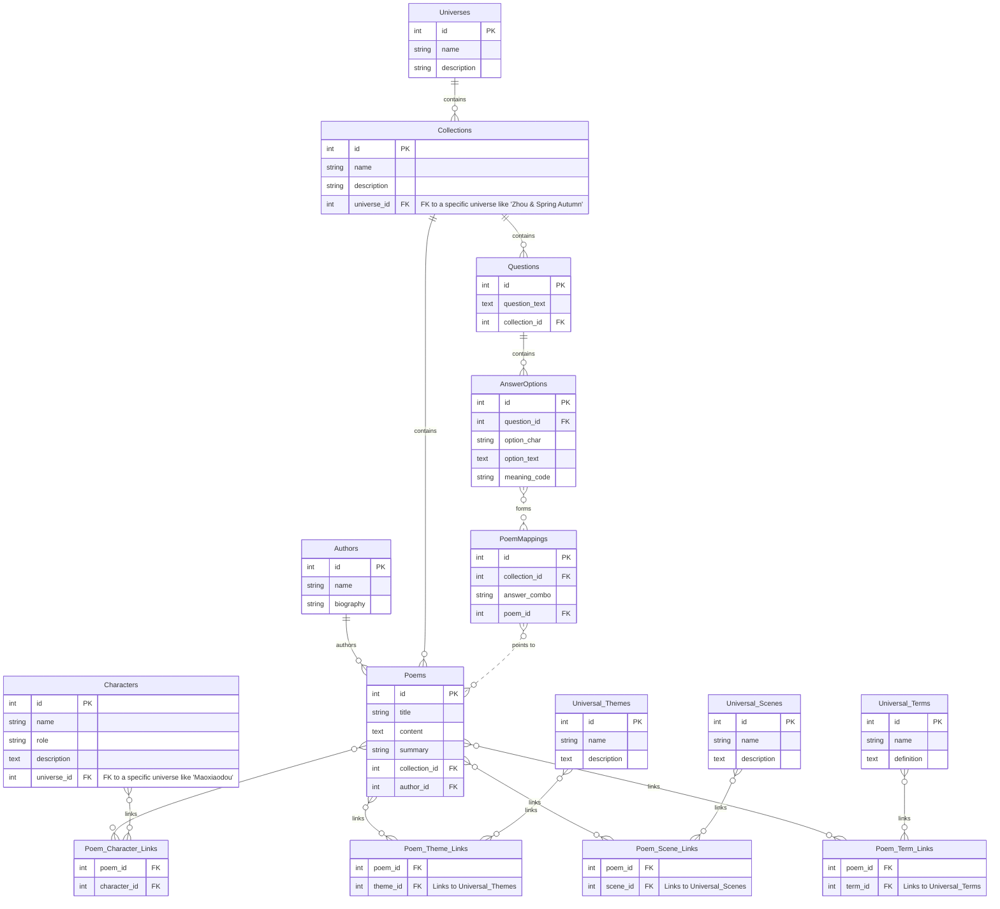

# 陆家花园主宇宙数据库设计 - v2 (草案)

## 实体关系图 (ERD) - v2

这是根据“主宇宙”关联模型修正后的数据库设计。它旨在建立一个统一的、高维度的概念层，让各子宇宙的内容映射其上，实现真正的跨宇宙融合。

## 设计解读 - v2

### 核心变更
1.  **概念中立化**: 移除了原 `Themes`, `Scenes`, `Terms` 表中的 `universe_id` 外键，并将它们重命名为 `Universal_Themes`, `Universal_Scenes`, `Universal_Terms`。这使它们成为了**独立于任何子宇宙的、可被全局共享的核心概念**。
2.  **关联解耦**: 诗歌 (`Poems`) 与这些通用概念的关联，完全通过链接表（如 `Poem_Theme_Links`）实现。这意味着，任何宇宙中的任何一首诗，都可以链接到任何一个通用主题上，从而实现了真正的跨宇宙数据融合。
3.  **保留特有实体**: 像 `Characters` 这样强绑定于某一宇宙的实体，仍然保留其 `universe_id` 外键，维持其特有属性。

### 总结
v2版本的Schema现在完全能够支撑我们设想的“陆家花园主宇宙”的关联模型。它结构清晰、高度可扩展，并为未来的跨宇宙功能奠定了坚实的数据基础。
