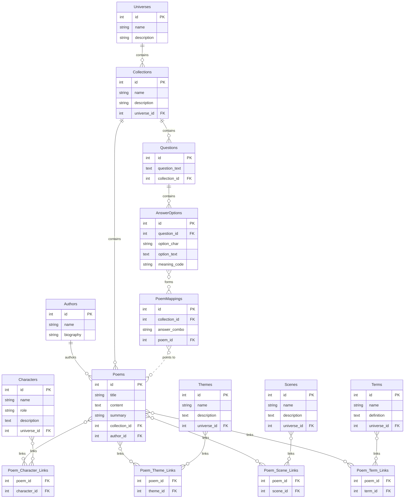

# 陆家花园主宇宙数据库设计 - v1

## 实体关系图 (ERD)

这是项目第一阶段设计的统一数据库模型。它旨在整合“毛小豆宇宙”和“周与春秋”两个子项目的数据。

## 设计解读

### 设计核心
1.  **核心实体表**: `Universes`, `Authors`, `Collections`, `Poems` 构成了内容的基本框架。`Characters`, `Themes`, `Scenes`, `Terms` 用于存储“毛小豆宇宙”的元数据。
2.  **交互逻辑表**: `Questions`, `AnswerOptions`, `PoemMappings` 复刻了“周与春秋”的引导式交互流程。
3.  **关系连接表**: 如 `Poem_Character_Links`，用于解决实体间“多对多”的复杂关系。

### 总结
该结构具备统一性、兼容性和可扩展性，能为两个子项目提供一个稳固且统一的数据基础。

